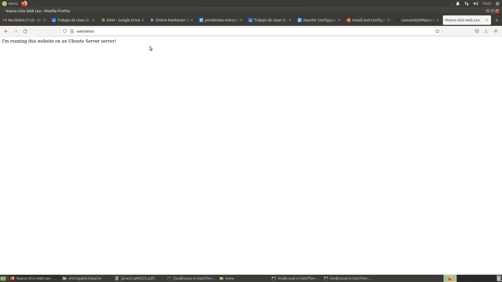

# Apache - Configuración 
_**Autor:** Leonardo Di Mauro. 22/10/2021_

### ¿Qué vamos a hacer?
Crearemos una página web sencilla y haremos la configuración necesaria para acceder a ella escribiendo el nombre de la web en el navegador, sin utilizar direcciones IP o la palabra localhost.

# PASO 1:

Crear una nueva carpeta donde ira nuestra página **index.html** con el comando:
```
sudo mkdir /var/www/web/
```
Accedemos a la carpeta **web** con el comando:
```
cd /var/www/web
```
Una vez dentro **creamos** un nuevo archivo de texto **index.html** con el comando:
```
nano index.html
```
Escribimos dentro este código:
```
<html>
<head>
  <title> Nuevo sitio Web Leo </title>
</head>
<body>
  <p> Web de prueba, funciona </p>
</body>
</html>
```

# PASO 2:

Es hora **configurar** apache, vamos a la carpeta **sites-avaible** con el comando:
```
cd /etc/apache2/sites-available/
```
Copiamos el archivo **000-default.conf** y creamos uno nuevo **web.conf** con su contenido, con el comando:
```
sudo cp 000-default.conf web.conf
```
Editamos el archivo **web.conf** con el comando:
```
sudo gedit web.conf
```
En la linea **DocumentRoot** cambiamos la ruta **/var/www/html** por **/var/www/web**

Añadimos justo debajo, de **DocumentRoot**, en el mismo archivo, la siguiente linea:
```
ServerName webdeleo
```
Debe quedar el archivo web.conf de la siguiente manera:
```
VirtualHost *:80>

        ServerAdmin webmaster@localhost
        DocumentRoot /var/www/web
        ServerName webdeleo

        ErrorLog ${APACHE_LOG_DIR}/error.log
        CustomLog ${APACHE_LOG_DIR}/access.log combined
</VirtualHost>
```
Después, modificar el archivo **hosts** con el comando:
```
sudo gedit /etc/hosts
```
Añadir a ultima linea:
```
127.0.0.1 webdeleo
```
Debe quedar el archivo de esta manera:
```
127.0.0.1       localhost
127.0.1.1       usuario-OptiPlex-380

# The following lines are desirable for IPv6 capable hosts
::1     ip6-localhost ip6-loopback
fe00::0 ip6-localnet
ff00::0 ip6-mcastprefix
ff02::1 ip6-allnodes
ff02::2 ip6-allrouters
127.0.0.1 webdeleo
```
Nos vamos a la carpeta **/etc/apache2/sites-available**  donde esta el archivo **web.conf** con el comando:
```
cd /etc/apache2/sites-available
```

Habilitamos la web con el comando:
```
sudo a2ensite web.conf
```
Reiniciamos Apache para aplicar los cambios con el comando:
```
systemctl reload apache2
```
Vamos al navegador y probamos escribiendo webdeleo en URL, se deberia ver algo como esto:



